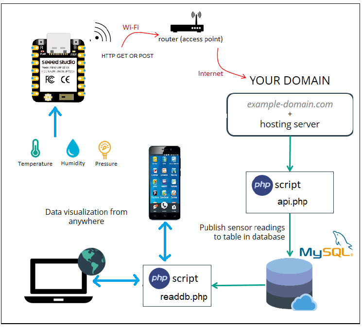
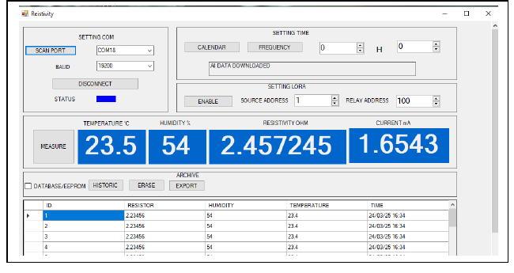

# Interface web de supervision de données avec ESP32-C6

Système IoT de **surveillance structurelle (SHM – Structural Health Monitoring)** permettant d'acquérir des mesures sur un ouvrage d'art (pont) avec une carte  **XIAO ESP32-C6** , de les transmettre par Wi-Fi à une API PHP, de les enregistrer dans une base MySQL et de les consulter depuis un tableau de bord web dédié aux équipes de maintenance et aux gestionnaires d'infrastructure.

Le dépôt contient également une interface Windows Forms complète en C# destinée à la communication série avec le boîtier de terrain, à la configuration de la carte et à la consultation des archives EEPROM/MySQL des inspections.

## Contexte

Les ponts sont soumis à des sollicitations continues (charges de trafic, variations climatiques, vieillissement des matériaux, corrosion des armatures) qui peuvent, à terme, compromettre leur intégrité. Ce projet propose une solution de **surveillance continue et à distance** de plusieurs indicateurs clés de l'état d'un ouvrage, afin de détecter précocement des signes de dégradation et de faciliter la planification de la maintenance préventive.

## Objectifs

* acquérir en continu des données représentatives de l'état du pont (température ambiante, humidité, résistance électrique liée à la corrosion des armatures, courant de fuite/jauge de contrainte) ;
* configurer facilement la connexion Wi-Fi du boîtier de terrain grâce à WiFiManager ;
* transmettre automatiquement les mesures par requête HTTP vers le serveur central ;
* enregistrer les valeurs dans une base de données distante pour un suivi historique de l'ouvrage ;
* afficher les dernières mesures et leur historique dans un tableau de bord web accessible aux équipes d'exploitation ;
* superviser et configurer localement le boîtier par port série avec une application C# Windows Forms, utile lors des inspections sur site.

## Architecture du système



Le fonctionnement suit cette chaîne :

1. les capteurs installés sur le tablier ou les piles du pont fournissent les mesures à l'ESP32-C6 ;
2. l'ESP32-C6 rejoint un réseau Wi-Fi (routeur du poste de contrôle ou passerelle 4G locale) ;
3. la carte construit une requête HTTP contenant la température, l'humidité, la résistance et le courant relevés ;
4. `web/api.php` valide les paramètres et les insère dans MySQL ;
5. `web/readings.php` retourne les mesures au format JSON ;
6. le tableau de bord actualise les valeurs et l'historique dans le navigateur, permettant un suivi en quasi temps réel de l'état du pont.

## Technologies

| Domaine            | Technologies                               |
| ------------------ | ------------------------------------------ |
| Microcontrôleur   | Seeed Studio XIAO ESP32-C6                 |
| Firmware           | Arduino/C++, WiFi, WiFiManager, HTTPClient |
| Backend            | PHP, PDO, API HTTP                         |
| Base de données   | MySQL / MariaDB, SQL                       |
| Interface web      | HTML, CSS, JavaScript                      |
| Application locale | C#, Windows Forms, liaison série          |
| Réseau            | Wi-Fi, HTTP GET, JSON                      |

## Structure du dépôt

```text
esp32-web-monitoring/
├── README.md
├── .gitignore
├── firmware/
│   ├── esp32-c6-uploader/
│   │   └── esp32-c6-uploader.ino
│   └── esp32-c6-serial-hmi/
│       └── esp32-c6-serial-hmi.ino
├── web/
│   ├── index.php
│   ├── style.css
│   ├── app.js
│   ├── api.php
│   ├── readings.php
│   ├── db.php
│   └── config.example.php
├── database/
│   └── schema.sql
├── desktop-hmi/
│   ├── Esp32Supervisor.sln
│   ├── Esp32Supervisor.csproj
│   ├── Form1.cs
│   ├── Form1.Designer.cs
│   └── README.md
└── assets/
    └── images/
```

## Firmware ESP32-C6

Le programme situé dans `firmware/esp32-c6-uploader/` :

- crée un point d’accès temporaire si aucun réseau n’est mémorisé ;
- présente l’interface de configuration WiFiManager ;
- se connecte ensuite au routeur en mode station ;
- construit l’URL de l’API à partir des mesures ;
- envoie périodiquement les valeurs au serveur ;
- affiche la réponse HTTP sur le moniteur série.

Avant le téléversement, remplace l’adresse suivante :

```cpp
const char* API_URL = "https://example.com/api.php";
```

par l’adresse réelle de ton hébergement.

### Acquisition des capteurs

La fonction suivante contient actuellement des valeurs de démonstration :

```cpp
Measurements readMeasurements();
```

Il faut la connecter aux capteurs réellement utilisés dans le projet. L’architecture accepte quatre mesures :

- température en degrés Celsius ;
- humidité relative en pourcentage ;
- résistance en ohms ;
- courant en milliampères.

### Bibliothèques Arduino

- `WiFi.h` ;
- `WiFiManager.h` ;
- `HTTPClient.h`.

## Base de données

Exécute `database/schema.sql` dans phpMyAdmin ou dans un client MySQL. Le script crée la base `esp32_supervision` et la table suivante :

| Colonne         | Type             | Rôle                            |
| --------------- | ---------------- | -------------------------------- |
| `id`          | BIGINT           | identifiant auto-incrémenté    |
| `temperature` | FLOAT            | température mesurée            |
| `humidity`    | FLOAT            | humidité relative               |
| `resistance`  | DOUBLE           | résistance mesurée             |
| `current_ma`  | DOUBLE, nullable | courant mesuré en milliampères |
| `created_at`  | TIMESTAMP        | date enregistrée par le serveur |

## Configuration du serveur

1. Copie le fichier d’exemple :

```bash
cp web/config.example.php web/config.php
```

2. Renseigne les paramètres MySQL dans `web/config.php` :

```php
return [
    'host' => 'localhost',
    'database' => 'esp32_supervision',
    'user' => 'database_user',
    'password' => 'database_password',
];
```

3. Transfère le contenu du dossier `web/` sur un hébergement compatible PHP/MySQL.

Le fichier `config.php` est ignoré par Git afin d’éviter la publication des identifiants de connexion.

## API HTTP

### Ajouter une mesure

```text
GET /api.php?t=23.5&h=54&r=2.457245&c=1.65434
```

Paramètres :

| Paramètre | Signification             |
| ---------- | ------------------------- |
| `t`      | température              |
| `h`      | humidité                 |
| `r`      | résistance               |
| `c`      | courant en mA, facultatif |

Réponse attendue :

```json
{
  "status": "success",
  "message": "Measurement saved"
}
```

### Lire les mesures

```text
GET /readings.php?limit=50
```

La réponse contient les dernières valeurs au format JSON. La limite est volontairement bornée entre 1 et 500 enregistrements.

## Tableau de bord web

Le fichier `web/index.php` présente :

- la dernière température ;
- la dernière humidité ;
- la dernière résistance ;
- le dernier courant ;
- un tableau des 50 dernières mesures ;
- une actualisation manuelle ;
- une actualisation automatique toutes les dix secondes.

Le tableau de bord utilise uniquement HTML, CSS et JavaScript natifs.

## Interface de supervision C#



Le dossier `desktop-hmi/` contient maintenant une application Windows Forms complète construite selon le fonctionnement du support de cours fourni. Elle utilise une liaison série asynchrone avec la carte XIAO ESP32-C6 et un protocole de commandes `AT+...`.

Fonctions disponibles :

- scan des ports COM ;
- sélection du débit et connexion en 8N1 ;
- synchronisation de l’horloge avec `AT+T=` ;
- réglage de la fréquence avec `AT+F=` ;
- configuration des adresses LoRa avec `AT+A=` ;
- mesure instantanée avec `AT+M?` ;
- téléchargement de l’historique EEPROM avec `AT+H?` ;
- effacement de l’EEPROM avec `AT+E?` ;
- lecture et suppression des données MySQL ;
- export de l’historique en TXT ou CSV.

Pour ouvrir l’application, utilise :

```text
desktop-hmi/Esp32Supervisor.sln
```

Le projet cible **.NET Framework 4.8.1** et utilise le paquet NuGet `MySql.Data`. Les instructions détaillées se trouvent dans `desktop-hmi/README.md`.

Le firmware de démonstration `firmware/esp32-c6-serial-hmi/esp32-c6-serial-hmi.ino` permet de tester toutes les commandes sans capteurs réels.

## Mise en service

1. créer la base avec `database/schema.sql` ;
2. configurer `web/config.php` ;
3. publier le dossier `web/` sur le serveur ;
4. tester manuellement l’API dans le navigateur ;
5. renseigner l’URL de l’API dans le firmware ;
6. installer les bibliothèques Arduino nécessaires ;
7. téléverser le programme dans le XIAO ESP32-C6 ;
8. connecter le téléphone au point d’accès `ESP32-Supervisor` lors de la première configuration ;
9. sélectionner le routeur Wi-Fi ;
10. vérifier les réponses HTTP dans le moniteur série ;
11. ouvrir `index.php` pour consulter les mesures ;
12. ouvrir `desktop-hmi/Esp32Supervisor.sln` dans Visual Studio 2022 pour tester la supervision série.

## Sécurité et bonnes pratiques

- ne jamais publier `web/config.php` ;
- utiliser HTTPS sur le serveur ;
- remplacer les requêtes GET par des requêtes POST pour une version de production ;
- ajouter une clé API ou un mécanisme d’authentification ;
- limiter la fréquence d’envoi ;
- valider les plages plausibles de chaque capteur ;
- éviter de placer des mots de passe Wi-Fi directement dans le code source.

## État du projet

Le dépôt contient désormais deux chaînes de supervision complémentaires :

- une chaîne distante `ESP32-C6 → Wi-Fi → PHP → MySQL → navigateur` ;
- une chaîne locale `ESP32-C6 → USB série → application C# Windows Forms`.

Les éléments restant à adapter au matériel final sont la lecture physique des capteurs, l’URL réelle du serveur et les identifiants MySQL locaux ou distants. Le code C# est complet pour les fonctions du protocole de démonstration, mais les commandes doivent rester cohérentes avec le firmware réellement chargé dans la carte.

## Auteur

Projet réalisé dans le cadre d’un travail sur les systèmes connectés, les bases de données et la supervision de mesures avec ESP32-C6.
